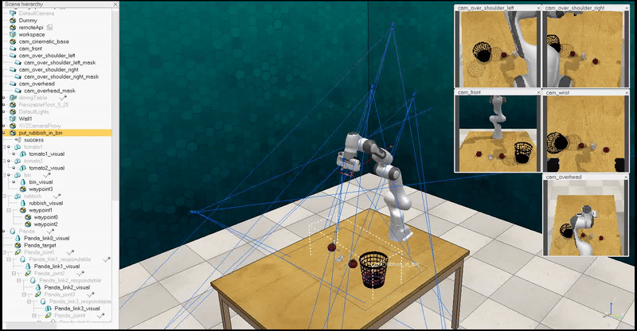

## LexiArm: Transforming Natural Language into Robotic Manipulation

In this repo, we provide the implementation of LexiArm in [RLBench](https://sites.google.com/view/rlbench) as its task diversity best resembles our real-world setup. Note that LexiArm is a zero-shot method that does not require any training data. Therefore, the main purpose of this repo is to provide a demo implementation rather than an evaluation benchmark.

**Note: This codebase does not contain the perception pipeline used in our real-world experiments with Panda arm, which produces a real-time mapping from object names to object masks. Instead, it uses the object masks provided as part of RLBench's `get_observation` function. If you are interested in deploying the code on a real robot, you may find more information in the section [Real World Deployment](#real-world-deployment).**

## Setup Instructions

Note that this codebase is best run with a display. For running in headless mode, refer to the [instructions in RLBench](https://github.com/stepjam/RLBench#running-headless).

- Create a conda environment:
```Shell
conda create -n LexiArm-env python=3.9
conda activate LexiArm-env
```

- See [Instructions](https://github.com/stepjam/RLBench#install) to install PyRep and RLBench (Note: install these inside the created conda environment).

- Install other dependencies:
```Shell
pip install -r requirements.txt
```

- Obtain an [OpenAI API](https://openai.com/blog/openai-api) key, and put it inside the first cell of the demo notebook.

## Running Demo

Demo code is at `src/playground.ipynb`. Instructions can be found in the notebook.

## Code Structure

Core to LexiArm:

- **`playground.ipynb`**: Interactive notebook for experimenting with LexiArm.  
- **`LMP.py`**: Implements Language Model Programs (LMPs) to recursively generate code for decomposing instructions and composing value maps for each sub-task.  
- **`interfaces.py`**: Provides APIs for language models (LMPs) to operate in voxel space and invoke the motion planner.  
- **`planners.py`**: Implements a greedy planner to generate trajectories (waypoints) for an entity/movable based on a value map.  
- **`controllers.py`**: Executes robot actions to move an entity/movable toward a given waypoint.  
- **`dynamics_models.py`**: Environment dynamics model for handling objects and object parts, used in `controllers.py` for Model Predictive Control (MPC).  
- **`prompts/rlbench`**: Contains prompts used by various Language Model Programs (LMPs) in LexiArm.  

Environment and utilities:

- **`envs`**:  
  - **`rlbench_env.py`**: Wrapper for the RLBench environment, providing useful functions for LexiArm.  
  - **`task_object_names.json`**: Maps object names used in LexiArm to their corresponding scene object names for each task.  

- **`configs/rlbench_config.yaml`**: Configuration file for all modules within the RLBench environment.  
- **`arguments.py`**: Parses arguments for the configuration file.  
- **`LLM_cache.py`**: Handles caching of language model outputs, writing to disk to reduce cost and processing time.  
- **`utils.py`**: Contains utility functions.  
- **`visualizers.py`**: A Plotly-based visualizer for value maps and planned trajectories.  

## Real-World Deployment  
To adapt the code for deployment on a real robot, most modifications should be limited to the environment file. For example, you can duplicate `rlbench_env.py` and implement the same APIs using your own perception and controller modules.  

Our perception pipeline consists of the following components:  
- [OWL-ViT](https://huggingface.co/docs/transformers/en/model_doc/owlvit) for open-vocabulary detection in the first frame.  
- [SAM](https://github.com/facebookresearch/segment-anything?tab=readme-ov-file#segment-anything) to convert bounding boxes into masks in the first frame.  
- [XMEM](https://github.com/hkchengrex/XMem) to track the masks across subsequent frames.  

You may also simplify the pipeline by using only an open-vocabulary detector and [SAM 2](https://github.com/facebookresearch/segment-anything?tab=readme-ov-file#latest-updates----sam-2-segment-anything-in-images-and-videos) for both segmentation and tracking.  

Our controller is built on the OSC implementation from [Deoxys](https://github.com/UT-Austin-RPL/deoxys_control).  

To minimize latency caused by multiple modules (especially in the perception pipeline), consider running a concurrent process dedicated solely to tracking.  

## Acknowledgments
- This environment is built upon [RLBench](https://sites.google.com/view/rlbench).
- The implementation of Language Model Programs (LMPs) is inspired by [Code as Policies](https://code-as-policies.github.io/).
- Some code snippets are adapted from [Where2Act](https://cs.stanford.edu/~kaichun/where2act/).
